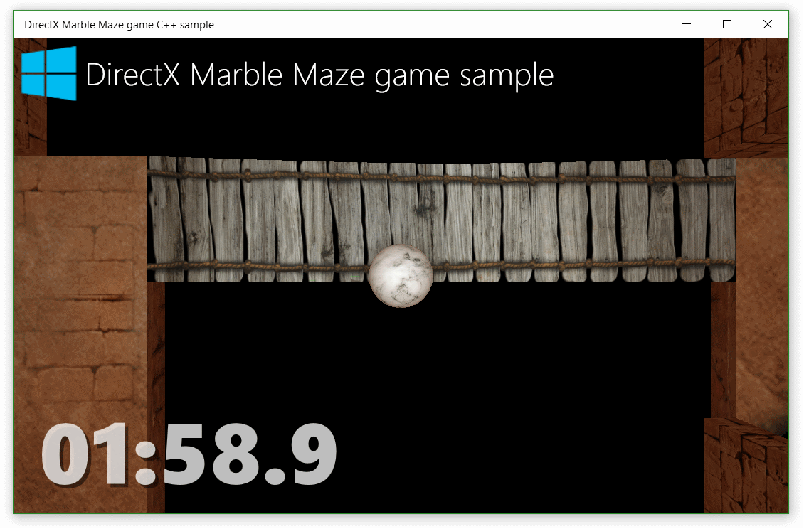

<!---
  category: Gaming GraphicsAndAnimation
  samplefwlink: http://go.microsoft.com/fwlink/?LinkId=624011
--->

# DirectX marble maze game sample

This is a mini-app that shows how to build a basic 3D game using DirectX on the Universal Windows Platform (UWP). 
It's a simple labyrinth game where the player is challenged to roll a marble through a maze of pitfalls using tilt, mouse, or gamepad controls.

This sample is written in C++ and requires some experience with graphics programming and DirectX. 
Complete content that examines this code can be found at 
[Developing Marble Maze, a UWP game in C++ and DirectX](https://msdn.microsoft.com/windows/uwp/gaming/developing-marble-maze-a-windows-store-game-in-cpp-and-directx).

## Features

- Incorporating the Windows Runtime into your DirectX game 
- Using DirectX to render 3D graphics for display in a game 
- Implementing simple vertex and pixel shaders with HLSL 
- Developing simple physics and collision behaviors in a DirectX game 
- Handling input from accelerometer, touch, mouse, and game controller with the Windows Runtime
- Playing and mixing sound effects and background music with XAudio2 

## Related topics

* [Developing Marble Maze, a UWP game in C++ and DirectX](https://docs.microsoft.com/windows/uwp/gaming/developing-marble-maze-a-windows-store-game-in-cpp-and-directx)
* [Create a simple UWP game with DirectX](https://msdn.microsoft.com/library/windows/apps/mt210793.aspx)
* [Game programming](https://docs.microsoft.com/windows/uwp/gaming/index)
* [DirectX programming](https://docs.microsoft.com/windows/uwp/gaming/directx-programming)
* [Direct3D Graphics Learning Guide](https://docs.microsoft.com/windows/uwp/graphics-concepts/)
* [Direct2D](https://msdn.microsoft.com/library/windows/desktop/dd370990) 
* [HLSL](https://msdn.microsoft.com/library/windows/desktop/bb509561.aspx)
* [XAudio2 APIs](https://msdn.microsoft.com/library/windows/desktop/hh405049)

## Universal Windows Platform development

This sample requires [Visual Studio 2017 and the latest version of the Windows 10 SDK](http://go.microsoft.com/fwlink/?LinkID=280676). You can use the free Visual Studio Community Edition to build and run Windows Universal Platform (UWP) apps. 

To get the latest updates to Windows and the development tools, and to help shape their development, join 
the [Windows Insider Program](https://insider.windows.com).

## Build the sample

1. Unzip the archive.
2. Start Microsoft Visual Studio 2017 and select **File** \> **Open** \> **Project/Solution...**
3. Starting in the folder where you unzipped the sample, go to the **C++** subfolder. Double-click **MarbleMaze_VS2017.sln**.
4. Press Ctrl+Shift+B, or select **Build** \> **Build Solution**.

## Run the sample

The next steps depend on whether you just want to deploy the sample or you want to both deploy and run it.

### Deploying the sample

Select **Build > Deploy Solution**. 

### Deploying and running the sample

To run the sample with debugging, press F5 or select **Debug > Start Debugging**. To run the sample without debugging, press Ctrl+F5 or select **Debug > Start Without Debugging**. 
